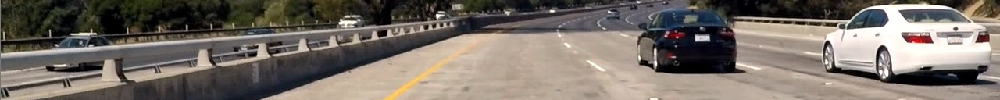
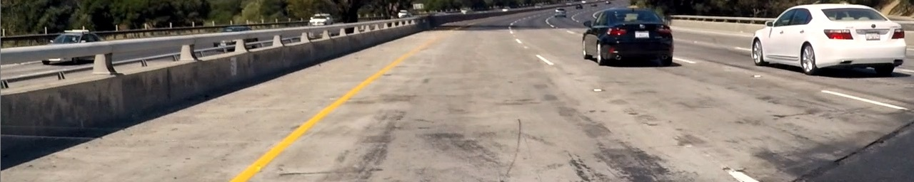
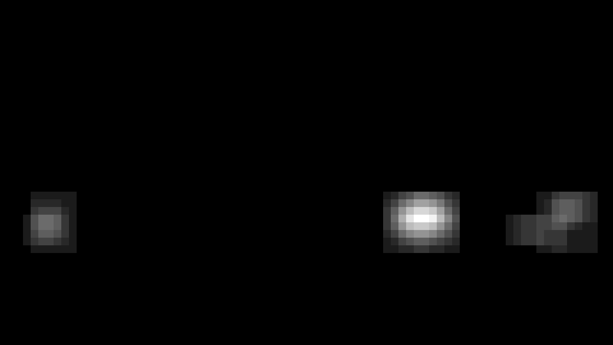
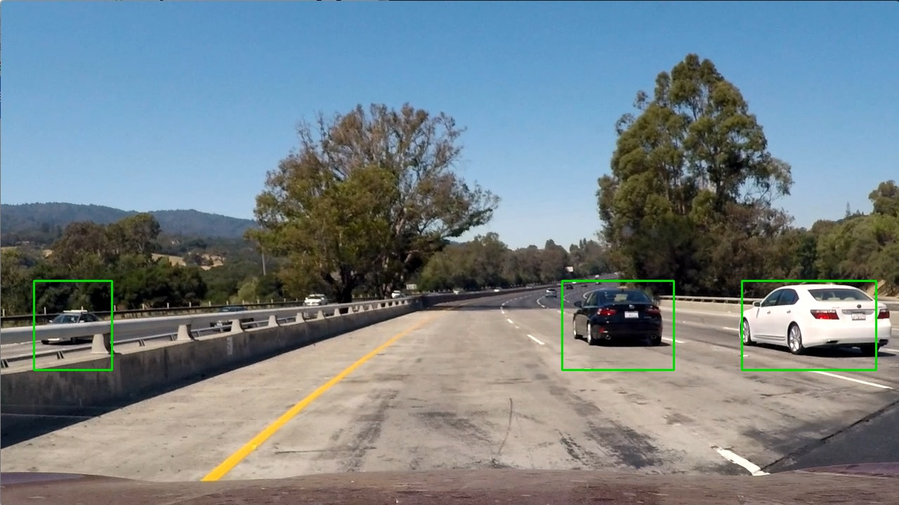

# Vehicle Detection Project

The goals / steps of this project are the following:

* Perform a Histogram of Oriented Gradients (HOG) feature extraction on a labeled training set of images and train a classifier Linear SVM classifier
* Optionally, you can also apply a color transform and append binned color features, as well as histograms of color, to your HOG feature vector. 
* Note: for those first two steps don't forget to normalize your features and randomize a selection for training and testing.
* Implement a sliding-window technique and use your trained classifier to search for vehicles in images.
* Run your pipeline on a video stream (start with the test_video.mp4 and later implement on full project_video.mp4) and create a heat map of recurring detections frame by frame to reject outliers and follow detected vehicles.
* Estimate a bounding box for vehicles detected.


---

Code in [Python notebook](./Vehicle%20Detection%20-%20NN.ipynb)

Final [video](./output/project_video.mp4)

### Rubric points

#### 1. Provide a Writeup / README that includes all the rubric points and how you addressed each one. 

You're reading it!

#### 1. Describe how (and identify where in your code) you trained a classifier.

**NOTE:** my implementation is based on a convolutional neural network. 

I trained convolutional neural network to detect cars. I used the given vehicles and non-vehicles dataset. Images are resized to 32x32, normalized
and then fed into the network. Data was splitted into training and test set using `train_test_split` method from skleearn with a ration 80% to 20%. This method perform a randomized split and data shuffling. The network shape is as follows:

```
Layer (type)                     Output Shape          Param #     Connected to                     
====================================================================================================
lambda_6 (Lambda)                (None, 32, 32, 3)     0           lambda_input_6[0][0]             
____________________________________________________________________________________________________
convolution2d_11 (Convolution2D) (None, 28, 28, 20)    1520        lambda_6[0][0]                   
____________________________________________________________________________________________________
activation_26 (Activation)       (None, 28, 28, 20)    0           convolution2d_11[0][0]           
____________________________________________________________________________________________________
maxpooling2d_11 (MaxPooling2D)   (None, 14, 14, 20)    0           activation_26[0][0]              
____________________________________________________________________________________________________
convolution2d_12 (Convolution2D) (None, 10, 10, 50)    25050       maxpooling2d_11[0][0]            
____________________________________________________________________________________________________
activation_27 (Activation)       (None, 10, 10, 50)    0           convolution2d_12[0][0]           
____________________________________________________________________________________________________
maxpooling2d_12 (MaxPooling2D)   (None, 5, 5, 50)      0           activation_27[0][0]              
____________________________________________________________________________________________________
flatten_6 (Flatten)              (None, 1250)          0           maxpooling2d_12[0][0]            
____________________________________________________________________________________________________
dense_19 (Dense)                 (None, 400)           500400      flatten_6[0][0]                  
____________________________________________________________________________________________________
activation_28 (Activation)       (None, 400)           0           dense_19[0][0]                   
____________________________________________________________________________________________________
dense_20 (Dense)                 (None, 120)           48120       activation_28[0][0]              
____________________________________________________________________________________________________
activation_29 (Activation)       (None, 120)           0           dense_20[0][0]                   
____________________________________________________________________________________________________
dropout_5 (Dropout)              (None, 120)           0           activation_29[0][0]              
____________________________________________________________________________________________________
dense_21 (Dense)                 (None, 84)            10164       dropout_5[0][0]                  
____________________________________________________________________________________________________
activation_30 (Activation)       (None, 84)            0           dense_21[0][0]                   
____________________________________________________________________________________________________
dropout_6 (Dropout)              (None, 84)            0           activation_30[0][0]              
____________________________________________________________________________________________________
dense_22 (Dense)                 (None, 1)             85          dropout_6[0][0]                  
____________________________________________________________________________________________________
activation_31 (Activation)       (None, 1)             0           dense_22[0][0]                   
====================================================================================================
Total params: 585,339
Trainable params: 585,339
Non-trainable params: 0
```

In the end I was able to achieve accuracy over 99%.

### Sliding Window Search

To search for car withing the image I have used `view_as_windows` method from `sklearn.util` package. It allows to easily iterate over parts of the image with a predefined window size and step size. The search is performed for three window sizes:
* 64x64
* 128x128
* 256x256

In all cases the overlap between consecutive frames is 75%. Each frame is then fed into the classifier to check for a car.

#### 2. Show some examples of test images to demonstrate how your pipeline is working.  What did you do to optimize the performance of your classifier?

The final pipeline has the following shape:
* slide 64x64 window between y=400 and y=528
* slide 128x128 window between y=400 and y=656
* slide 128x128 window between y=400 and y=526
* each of the slides return a collection of possitively matched coordintates 
* store the coordinates in a heatmap. Heatmap has layers to keep the history of findings. This is used to remove false positives
* based on the sum history of heatmap and threshold generate final heatmap and get box coordinates over the region
* draw a box using those coordinates over the original frame

Sample frame:


Area to search for 64x64 samples:



Area to search for 128x128 samples:



Area to search for 256x256 samples:


Heatmap:



Result:



---

### Video Implementation


#### 1. Provide a link to your final video output.  Your pipeline should perform reasonably well on the entire project video (somewhat wobbly or unstable bounding boxes are ok as long as you are identifying the vehicles most of the time with minimal false positives.)
Here's a [link to my video result](./project_video.mp4)

Final [video](./output/project_video.mp4)

[](http://www.youtube.com/watch?v=bUpcNnsPRgI)


#### 2. Describe how (and identify where in your code) you implemented some kind of filter for false positives and some method for combining overlapping bounding boxes.

False positives filtering with heatmap and finding the bounding boxes is described above with the pipeline.


---

### Discussion

#### 1. Briefly discuss any problems / issues you faced in your implementation of this project.  Where will your pipeline likely fail?  What could you do to make it more robust?

Initially I started with finding HOG features in the image based on the grayscale version. I tried to use a few shapes of feed forward network as the training results were giving high accuracy. To my surprise I received a lot of false positives while running the processing on test frames. It could have been due to some bug. However I couldn't see any suspicious so I decided to give a try an approach with color and spatial features added. With this accuracy of my network went down and the results were not acceptable.

I decided to try with convolutional neural network knowing how well they perform with images. I went forward with an architecture similar to LeNet using two convolutional layers, four dense layers and some dropout applied. Trainig results went to around 99%. With some fine tuning of the parameters and adjusting the search regions I achieved satisfying results.

The provided solution has the following deficiencies:
* model has been trained on a limited dataset. I would need a way bigger and more diverse dataset to make it work good in the wild
* for every frame we run predictions on 85 images (based on the sliding windows) thus the processing is slow. Also the size of the model is big so predictions are slow as well
* on the final video you can see detections on the left side. They are not false positives but delayed detections of cars. This is due to the way heatmap is implemented. We assume detecting cars going in the same direction so sudden changes can be treated as false positives. This is however not true for cars going in the opposite direction. The solution would be to implement a "sliding" heatmap and draw only on the last (current) frame detection.
